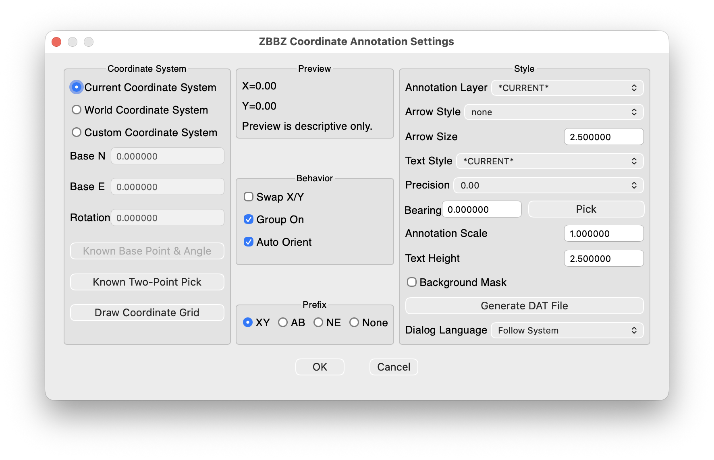
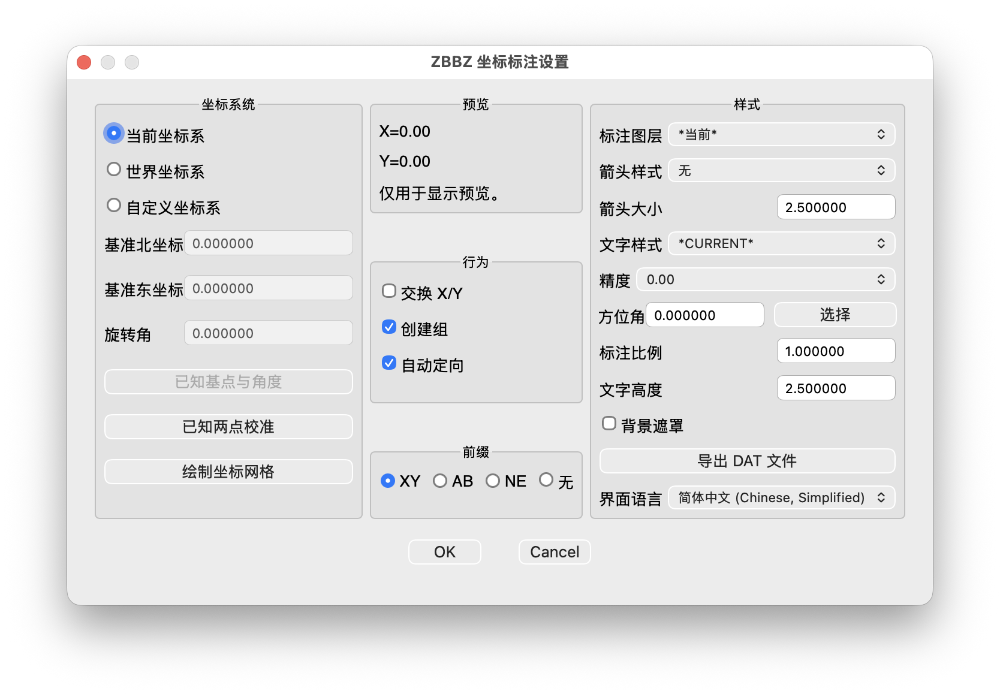

# ZBBZ for Autocad_Mac

AutoCAD for Mac coordinate annotation plugin built with AutoLISP and DCL.

ZBBZ 是一个 AutoCAD for Mac 坐标标注插件，使用 AutoLISP 和 DCL 实现。

## Features

- Add coordinate annotations with leader lines.
- Configure coordinate mode, base point, rotation, precision, prefix, layer, arrow style, text style, scale, and text height.
- Optional coordinate grid drawing.
- Two-point calibration for custom coordinate systems.
- DAT export for the current annotation session.
- English, Simplified Chinese, French, German, Italian, Japanese, Korean, and Spanish UI text.

## Settings UI



## 功能

- 添加带引线的坐标标注。
- 可设置坐标系统、基准点、旋转角、精度、前缀、图层、箭头样式、文字样式、比例和文字高度。
- 可绘制坐标网格。
- 支持通过已知两点校准自定义坐标系统。
- 可导出当前标注会话的 DAT 文件。
- 设置面板支持英文、简体中文、法语、德语、意大利语、日语、韩语和西班牙语。

## 设置界面



## Install

1. Download `ZBBZ.bundle.zip` from the latest GitHub Release.
2. Unzip it.
3. Copy `ZBBZ.bundle` to one of these folders:

```text
~/Library/Application Support/Autodesk/ApplicationAddins
/Applications/Autodesk/ApplicationAddins
```

4. Restart AutoCAD for Mac.
5. Run `ZBBZCONFIG` to open settings, or run `ZBBZ` to start annotation.

Do not use APPLOAD to select `ZBBZ.bundle` directly. On AutoCAD for Mac this can treat the bundle folder as a runtime extension and show an `acrxEntryPoint` error.

If you want to load manually with APPLOAD, select:

```text
ZBBZ.bundle/Contents/zbbz-mac.lsp
```

## 安装

1. 从 GitHub Release 下载 `ZBBZ.bundle.zip`。
2. 解压。
3. 把 `ZBBZ.bundle` 复制到以下任一目录：

```text
~/Library/Application Support/Autodesk/ApplicationAddins
/Applications/Autodesk/ApplicationAddins
```

4. 重启 AutoCAD for Mac。
5. 运行 `ZBBZCONFIG` 打开设置面板，或运行 `ZBBZ` 开始坐标标注。

不要在 APPLOAD 中直接选择 `ZBBZ.bundle` 文件夹。AutoCAD for Mac 可能会把它当作运行时扩展加载，并报 `acrxEntryPoint` 错误。

如果需要手动 APPLOAD，请选择：

```text
ZBBZ.bundle/Contents/zbbz-mac.lsp
```

## Commands

- `ZBBZCONFIG`: open the settings dialog.
- `ZBBZ`: start coordinate annotation with the saved settings.

## 命令

- `ZBBZCONFIG`：打开设置面板。
- `ZBBZ`：使用已保存设置开始坐标标注。
